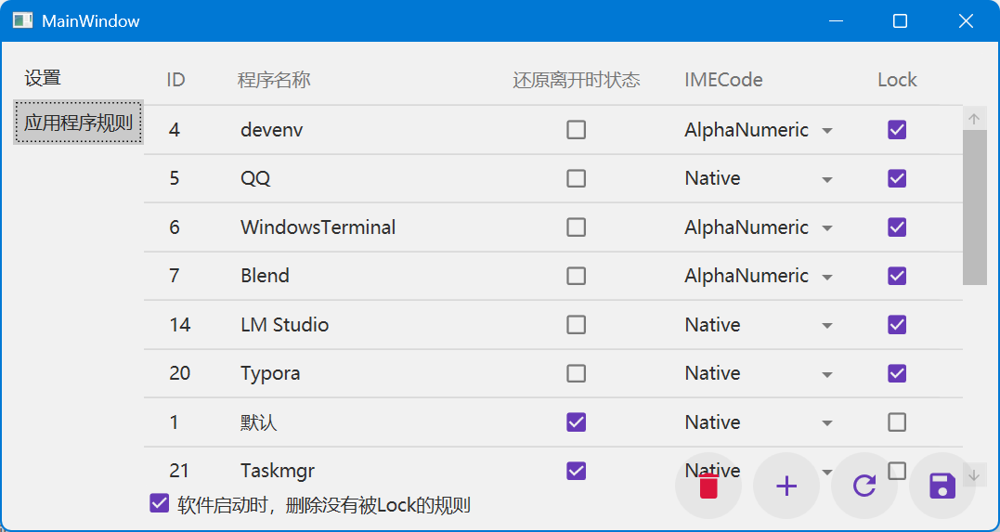

# IMECodeSwitcher

## 简介

IMECodeSwitcher 是一个用于解决微软拼音输入法在不同应用间切换时常自动变成英文键盘问题的WPF桌面应用程序。本程序旨在通过记录用户离开某一应用程序时的输入法状态，并在重新聚焦该应用程序时恢复其状态，从而提高文字输入效率。

## 功能描述

- **实时监控**：持续检测当前活跃的应用程序。
- **状态保存与恢复**：当用户切换到其他应用时保存当前输入法的状态（中文或英文），并在返回原应用时自动恢复此状态。

## 使用说明

1. 下载并安装应用程序。
2. 启动程序，确保其在后台持续运行。
3. 开始您的日常使用。当您发现输入法状态被自动改变时，无需手动调整，IMECodeSwitcher 将帮助您恢复到离开应用前的状态。

## 截图

## 致谢

- https://github.com/ZGGSONG/LangIndicator
- https://github.com/walterlv/Walterlv.ForegroundWindowMonitor
- https://home.cnblogs.com/u/SaoJian